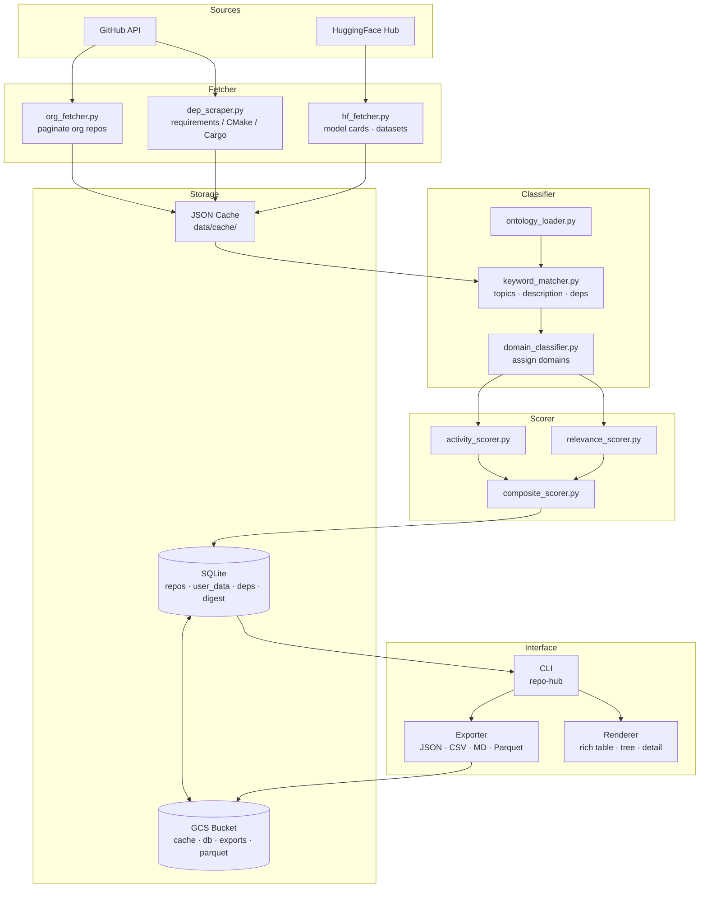
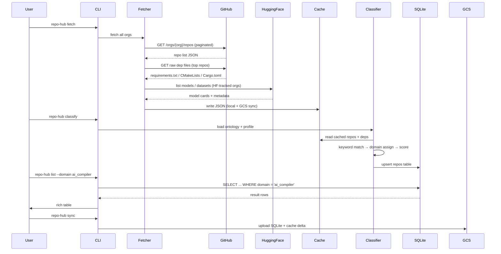

# Architecture & Technical Design

## Overview

repo-hub is a local-first CLI tool with cloud-backed storage. The core loop is: **fetch → classify → store → annotate → browse**. All classification and scoring runs locally. GCS is used for durability, sharing, and scale. HuggingFace Hub is a first-class data source alongside GitHub.

---

## Component Diagram



---

## Data Flow — Step by Step



---

## Storage Architecture

### Local (always present)

```
data/
├── cache/
│   ├── orgs/          # {org}.json  — raw GitHub API responses
│   └── deps/          # {org}/{repo}/{file} — scraped dep files
├── hf/
│   ├── models/        # {org}/{model}/README.md — HF model cards
│   └── datasets/      # {org}/{dataset}/README.md
└── repos.db           # SQLite working database
```

### GCS (durable, syncable)

```
gs://{REPO_HUB_GCS_BUCKET}/
├── cache/
│   ├── orgs/          # mirrors data/cache/orgs/   (24h TTL objects)
│   └── deps/          # mirrors data/cache/deps/
├── hf/                # mirrors data/hf/
├── db/
│   └── repos.db       # SQLite backup (uploaded on repo-hub sync)
├── exports/
│   └── {YYYY-MM-DD}/
│       ├── repos.json
│       ├── repos.csv
│       └── repos.parquet   # columnar, queryable with DuckDB
└── snapshots/
    └── {YYYY-MM-DD}-repos.db  # dated backups
```

### SQLite Schema

```sql
-- Auto-managed by classifier
CREATE TABLE repos (
    id                TEXT PRIMARY KEY,   -- {org}/{name}
    org               TEXT NOT NULL,
    name              TEXT NOT NULL,
    url               TEXT,
    description       TEXT,
    stars             INTEGER DEFAULT 0,
    forks             INTEGER DEFAULT 0,
    open_issues       INTEGER DEFAULT 0,
    language          TEXT,
    license           TEXT,               -- SPDX identifier
    last_pushed_at    TIMESTAMP,
    is_archived       BOOLEAN DEFAULT 0,
    is_fork           BOOLEAN DEFAULT 0,
    topics            TEXT,               -- JSON array
    assigned_domains  TEXT,               -- JSON array of domain IDs
    extracted_deps    TEXT,               -- JSON: {file: [dep, ...]}
    s_activity        REAL DEFAULT 0,
    s_ontology        REAL DEFAULT 0,
    s_deps            REAL DEFAULT 0,
    s_profile         REAL DEFAULT 0,
    score             REAL DEFAULT 0,
    matched_signals   TEXT,               -- JSON: {domain: [signal, ...]}
    source            TEXT DEFAULT 'github',  -- 'github' | 'huggingface'
    classified_at     TIMESTAMP,
    fetched_at        TIMESTAMP
);

-- Your second brain layer
CREATE TABLE user_data (
    repo_id           TEXT PRIMARY KEY REFERENCES repos(id),
    status            TEXT DEFAULT 'new',
    -- new | reviewing | bookmarked | in-use | dismissed
    tags              TEXT DEFAULT '[]',  -- JSON array
    notes             TEXT,               -- freeform markdown
    projects          TEXT DEFAULT '[]',  -- JSON: your project names
    priority          INTEGER DEFAULT 0,  -- 0=normal, 1=high, 2=critical
    first_seen_at     TIMESTAMP DEFAULT CURRENT_TIMESTAMP,
    last_reviewed_at  TIMESTAMP
);

-- Dependency graph (cross-repo relationships)
CREATE TABLE dep_edges (
    from_repo         TEXT REFERENCES repos(id),
    dep_name          TEXT NOT NULL,      -- package/library name
    dep_type          TEXT,               -- python | cmake | cargo | npm | go
    resolved_repo     TEXT REFERENCES repos(id),  -- NULL if not in our DB
    PRIMARY KEY (from_repo, dep_name, dep_type)
);

-- Digest / change log
CREATE TABLE digest (
    id                INTEGER PRIMARY KEY AUTOINCREMENT,
    repo_id           TEXT REFERENCES repos(id),
    event             TEXT,               -- new_repo | star_delta | push | archived
    detail            TEXT,               -- JSON payload
    detected_at       TIMESTAMP DEFAULT CURRENT_TIMESTAMP
);

-- HuggingFace repos (same scoring pipeline)
CREATE TABLE hf_repos (
    id                TEXT PRIMARY KEY,   -- {org}/{name}
    org               TEXT,
    name              TEXT,
    type              TEXT,               -- model | dataset | space
    downloads         INTEGER DEFAULT 0,
    likes             INTEGER DEFAULT 0,
    tags              TEXT,               -- JSON array
    pipeline_tag      TEXT,               -- e.g. text-generation
    assigned_domains  TEXT,
    score             REAL DEFAULT 0,
    fetched_at        TIMESTAMP
);
```

---

## HuggingFace Hub Integration

HuggingFace is a parallel data source, not just an org on GitHub. The `hf` subcommand manages it.

### What we pull from HF

| Resource | API | Purpose |
|---|---|---|
| Models | `GET /api/models?author={org}` | Track models from known orgs (Intel, AMD, NVIDIA, HF, etc.) |
| Datasets | `GET /api/datasets?author={org}` | Training and benchmark datasets |
| Model cards | `GET /{org}/{model}/raw/main/README.md` | Rich text for classification |
| Spaces | `GET /api/spaces?author={org}` | Demos and inference apps |

### Cross-referencing

When a GitHub repo's name or description matches a HuggingFace model (e.g., `microsoft/phi` on both), we link them in `dep_edges` with `dep_type = 'hf_model'`. This lets you see: "This training repo produces this HF model."

### HuggingFace Orgs Tracked

`huggingface` · `microsoft` · `google` · `meta-llama` · `mistralai` · `EleutherAI` · `Stability-AI` · `BAAI` · `internlm` · `Qwen` · `deepseek-ai` · `nvidia` · `intel` · `tiiuae` (Falcon)

---

## Scalability Design

### Current scale: ~75 orgs × ~100 repos = ~7,500 repos

SQLite handles this with zero overhead. Full classify run: < 30 seconds.

### Scale tier 2: ~200 orgs × ~300 repos = ~60,000 repos

Still SQLite. Dep scraping becomes the bottleneck (rate limits). Solution: async fetch with worker pool (5–10 concurrent), GCS cache shared across machines.

### Scale tier 3: ~500 orgs, shared team use

Options:
- **DuckDB on GCS Parquet** — query `repos.parquet` directly from GCS without downloading. Zero server.
- **BigQuery** — load Parquet exports to BQ for ad-hoc SQL from anywhere.
- **PostgreSQL** — if you need concurrent writes (multiple contributors annotating).

The export pipeline always produces Parquet (via `pyarrow`), so any of these is one command away.

### Rate limits

| Source | Unauthenticated | With token |
|---|---|---|
| GitHub REST | 60 req/hr | 5,000 req/hr |
| GitHub raw content | shared pool | same token |
| HuggingFace API | 1,000 req/hr | higher with token |

For 75 orgs: ~750 list requests + ~3,750 dep file fetches = 4,500 total. Requires GitHub token. GCS cache means you only re-fetch what has changed (using `Last-Modified` / `ETag` headers).

---

## Tech Stack

| Component | Technology | Why |
|---|---|---|
| CLI framework | Click | subcommands, help text, composable |
| HTTP client | requests + httpx (async) | sync for simple calls, async for dep scraping |
| Terminal UI | rich | tables, trees, progress bars, panels |
| Config | PyYAML + tomli | YAML for human-editable configs, TOML for pyproject |
| Local DB | SQLite via sqlite3 | zero setup, fast, file-portable |
| GCS client | google-cloud-storage | native GCS SDK |
| Columnar export | pyarrow + pandas | Parquet generation for analytics |
| HuggingFace | huggingface_hub | official SDK for HF API |
| Dep parsing | stdlib (tomllib/tomli, json, re) | no heavy parsers needed |
| Python | 3.9+ | matches existing virtualenv |

---

## Configuration Files

```
config/
├── orgs.yaml        # org registry (GitHub handles + HF orgs + per-org overrides)
├── ontology.yaml    # 18-domain taxonomy with signal keywords per domain
└── profile.yaml     # your interest profile: domain weights + tech interests
```

Environment variables (`.env`):

```bash
GITHUB_TOKEN=ghp_...
HF_TOKEN=hf_...
REPO_HUB_GCS_BUCKET=your-bucket-name
REPO_HUB_GCS_PREFIX=repo-hub/           # optional path prefix inside bucket
REPO_HUB_DATA_DIR=./data                 # local data root
REPO_HUB_CONFIG_DIR=./config
```

---

## Directory Layout (final)

```
repo-hub/
├── README.md
├── docs/
│   ├── ARCHITECTURE.md   ← this file
│   ├── ONTOLOGY.md
│   ├── ORGS.md
│   └── SCORING.md
├── config/
│   ├── orgs.yaml
│   ├── ontology.yaml
│   └── profile.yaml
├── repo_hub/
│   ├── __init__.py
│   ├── cli.py                   # Click entry point, all command groups
│   ├── fetcher/
│   │   ├── github_client.py     # rate-limited GitHub REST wrapper
│   │   ├── org_fetcher.py       # paginate org repos
│   │   ├── dep_scraper.py       # fetch + parse dep files
│   │   └── hf_fetcher.py        # HuggingFace Hub API
│   ├── classifier/
│   │   ├── ontology_loader.py
│   │   ├── keyword_matcher.py   # signal matching (topics/desc/deps/filenames)
│   │   └── domain_classifier.py
│   ├── scorer/
│   │   ├── activity_scorer.py
│   │   ├── relevance_scorer.py
│   │   └── composite_scorer.py
│   ├── storage/
│   │   ├── cache.py             # JSON cache with TTL
│   │   ├── db.py                # SQLite façade
│   │   └── gcs.py               # GCS sync (upload/download/delta)
│   └── renderer/
│       ├── table.py
│       ├── tree.py
│       └── export.py            # JSON · CSV · Markdown · Parquet
├── data/                        # runtime-generated, git-ignored
├── pyproject.toml
├── .env.example
└── .gitignore
```
