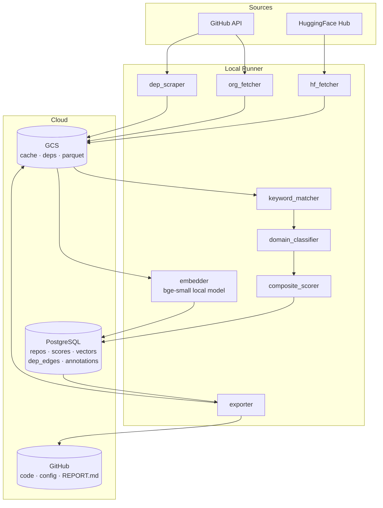
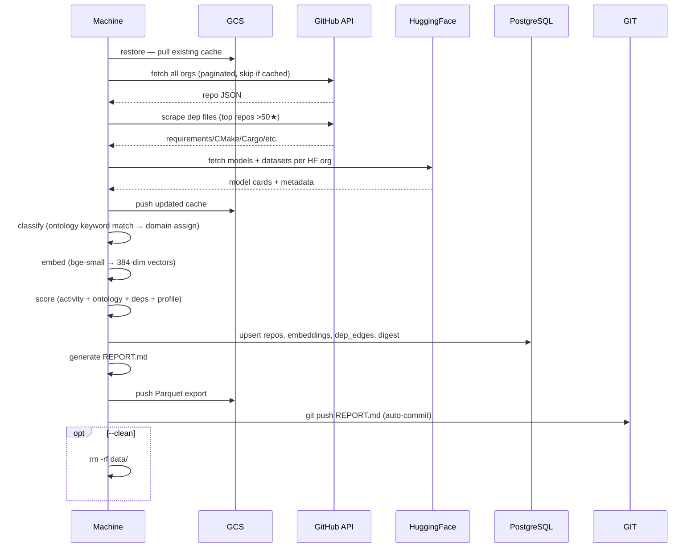

# Architecture & Technical Design

## Implementation Phases

| Phase | Capabilities added | Key new commands |
|---|---|---|
| **1 — Foundation** | Fetch · keyword classify · score · embed · annotate · push/restore | `fetch` `classify` `list` `show` `annotate` `digest` |
| **2 — Intelligence** | Hourly pulse watcher · contributor tracking · LLM classification | `pulse` `contributors` |
| **3 — Graph** | Kuzu knowledge graph · dep + contributor edges · tech node linking | `graph` |
| **4 — Synthesis** | RAG query interface · semantic recommendations | `ask` `discover` |

---

## Core Principle: Ephemeral Compute, Persistent Cloud State

The local machine is a **runner only** — it holds no permanent state. All data lives in three cloud stores. You can `git clone`, run the full pipeline, push everything back, wipe the local machine, and resume identically on any other machine.

```
┌─────────────────────────────────────────────────────┐
│  Any Machine  (ephemeral)                           │
│                                                     │
│   git clone · pip install -e . · .env (tokens)     │
│   ↓                                                 │
│   repo-hub restore   ← pulls GCS cache             │
│   repo-hub all       → fetch + classify + embed     │
│                        + score + push               │
│   repo-hub clean     → data/ deleted                │
└─────────────────────────────────────────────────────┘
         ↕ GitHub       ↕ GCS           ↕ PostgreSQL
┌────────────────┐ ┌──────────────┐ ┌──────────────────┐
│ Code · config  │ │ Raw cache    │ │ Repos · scores   │
│ ontology       │ │ Dep files    │ │ Embeddings       │
│ profile        │ │ Parquet      │ │ Dep graph        │
│ REPORT.md      │ │ DB exports   │ │ Your annotations │
└────────────────┘ └──────────────┘ └──────────────────┘
  Control plane      Blob store        Data plane
```

---

## What Lives Where

| Store | Contents | Why here |
|---|---|---|
| **GitHub** | Code, `config/`, `docs/`, auto-generated `REPORT.md` | Version-controlled, machine-independent entry point |
| **PostgreSQL** (Supabase/Neon) | `repos`, `user_data`, `dep_edges`, `repo_embeddings`, `hf_repos`, `digest` | Queryable from any machine with no local data, pgvector semantic search |
| **GCS** | `cache/orgs/*.json`, `cache/deps/`, `hf/`, `exports/*.parquet`, `snapshots/` | Large blobs unsuitable for git or PG; cheap, durable object storage |
| **Local `data/`** | Temporary scratch only | Deleted after `repo-hub push --clean`; never the source of truth |

---

## Component Diagram



---

## Full Pipeline — `repo-hub all`



---

## Machine Lifecycle

### First time on any machine

```bash
git clone https://github.com/rajaghv-dev/repo-hub
cd repo-hub
cp .env.example .env          # fill in 4 values: GITHUB_TOKEN, HF_TOKEN,
                               # REPO_HUB_GCS_BUCKET, DATABASE_URL
pip install -e .
repo-hub restore               # pulls GCS cache, verifies PG connection
repo-hub all --clean           # full run, wipe local data when done
```

### Subsequent runs (same or different machine)

```bash
git pull                       # get latest config/profile changes
repo-hub all --clean           # always starts from GCS cache + PG state
```

### Browse without running (any machine)

```bash
git clone ...
pip install -e . && cp .env.example .env
repo-hub list                  # queries PG directly — no local data needed
repo-hub search "MLIR runtime" # pgvector semantic search — no local data needed
repo-hub annotate intel/llvm-project --status bookmarked
```

The `list`, `show`, `search`, `annotate`, `stats`, and `digest` commands query PostgreSQL directly. They never need `data/`.

---

## PostgreSQL Schema

```sql
CREATE EXTENSION IF NOT EXISTS vector;       -- pgvector
CREATE EXTENSION IF NOT EXISTS pg_trgm;      -- fuzzy text search
CREATE EXTENSION IF NOT EXISTS "uuid-ossp";

-- Core repo table
CREATE TABLE repos (
    id                TEXT PRIMARY KEY,           -- {org}/{name}
    org               TEXT NOT NULL,
    name              TEXT NOT NULL,
    url               TEXT,
    description       TEXT,
    stars             INTEGER DEFAULT 0,
    forks             INTEGER DEFAULT 0,
    open_issues       INTEGER DEFAULT 0,
    language          TEXT,
    license           TEXT,                       -- SPDX identifier
    last_pushed_at    TIMESTAMPTZ,
    is_archived       BOOLEAN DEFAULT FALSE,
    is_fork           BOOLEAN DEFAULT FALSE,
    topics            JSONB DEFAULT '[]',
    assigned_domains  JSONB DEFAULT '[]',         -- array of domain IDs
    extracted_deps    JSONB DEFAULT '{}',         -- {file: [dep, ...]}
    s_activity        REAL DEFAULT 0,
    s_ontology        REAL DEFAULT 0,
    s_deps            REAL DEFAULT 0,
    s_profile         REAL DEFAULT 0,
    score             REAL DEFAULT 0,
    matched_signals   JSONB DEFAULT '{}',         -- {domain: [signal, ...]}
    source            TEXT DEFAULT 'github',      -- 'github' | 'huggingface'
    classified_at     TIMESTAMPTZ,
    fetched_at        TIMESTAMPTZ
);

-- Vector embeddings (separate table — only populated for classified repos)
CREATE TABLE repo_embeddings (
    repo_id     TEXT PRIMARY KEY REFERENCES repos(id) ON DELETE CASCADE,
    embedding   vector(384),                      -- bge-small-en-v1.5 output
    model       TEXT DEFAULT 'BAAI/bge-small-en-v1.5',
    embedded_at TIMESTAMPTZ DEFAULT NOW()
);

-- Your second brain annotation layer
CREATE TABLE user_data (
    repo_id          TEXT PRIMARY KEY REFERENCES repos(id) ON DELETE CASCADE,
    status           TEXT DEFAULT 'new',
    -- new | reviewing | bookmarked | in-use | dismissed
    tags             JSONB DEFAULT '[]',
    notes            TEXT,                        -- freeform markdown
    projects         JSONB DEFAULT '[]',          -- your project names
    priority         INTEGER DEFAULT 0,           -- 0=normal 1=high 2=critical
    first_seen_at    TIMESTAMPTZ DEFAULT NOW(),
    last_reviewed_at TIMESTAMPTZ
);

-- Dependency graph edges (cross-repo relationships)
CREATE TABLE dep_edges (
    from_repo     TEXT REFERENCES repos(id) ON DELETE CASCADE,
    dep_name      TEXT NOT NULL,
    dep_type      TEXT,                           -- python|cmake|cargo|npm|go
    resolved_repo TEXT REFERENCES repos(id),      -- NULL if not in our DB
    PRIMARY KEY (from_repo, dep_name, dep_type)
);

-- Change log — powers digest command
CREATE TABLE digest (
    id           BIGSERIAL PRIMARY KEY,
    repo_id      TEXT REFERENCES repos(id) ON DELETE CASCADE,
    event        TEXT,                            -- new_repo|star_delta|push|archived
    detail       JSONB,
    detected_at  TIMESTAMPTZ DEFAULT NOW()
);

-- HuggingFace repos (parallel to repos table)
CREATE TABLE hf_repos (
    id           TEXT PRIMARY KEY,               -- {org}/{name}
    org          TEXT,
    name         TEXT,
    type         TEXT,                           -- model|dataset|space
    downloads    INTEGER DEFAULT 0,
    likes        INTEGER DEFAULT 0,
    tags         JSONB DEFAULT '[]',
    pipeline_tag TEXT,
    assigned_domains JSONB DEFAULT '[]',
    score        REAL DEFAULT 0,
    fetched_at   TIMESTAMPTZ
);

-- Indexes
CREATE INDEX idx_repos_score        ON repos (score DESC);
CREATE INDEX idx_repos_org          ON repos (org);
CREATE INDEX idx_repos_language     ON repos (language);
CREATE INDEX idx_repos_pushed       ON repos (last_pushed_at DESC);
CREATE INDEX idx_repos_topics       ON repos USING GIN (topics);
CREATE INDEX idx_repos_domains      ON repos USING GIN (assigned_domains);
CREATE INDEX idx_repos_deps         ON repos USING GIN (extracted_deps);
CREATE INDEX idx_repos_fts          ON repos USING GIN (
    to_tsvector('english', coalesce(name,'') || ' ' || coalesce(description,''))
);
CREATE INDEX idx_user_data_status   ON user_data (status);
CREATE INDEX idx_dep_edges_from     ON dep_edges (from_repo);
CREATE INDEX idx_dep_edges_resolved ON dep_edges (resolved_repo);

-- Vector index (HNSW — fast approximate search)
CREATE INDEX idx_embeddings_hnsw ON repo_embeddings
    USING hnsw (embedding vector_cosine_ops)
    WITH (m = 16, ef_construction = 64);
```

---

## GCS Layout

```
gs://{REPO_HUB_GCS_BUCKET}/
├── cache/
│   ├── orgs/            # {org}.json  — raw GitHub API (24h TTL)
│   └── deps/            # {org}/{repo}/{file}  — scraped dep files
├── hf/
│   ├── models/          # {org}/{model}/README.md
│   └── datasets/        # {org}/{dataset}/README.md
├── exports/
│   └── {YYYY-MM-DD}/
│       ├── repos.parquet      # full snapshot, queryable via DuckDB
│       ├── repos.csv
│       └── summary.json
└── snapshots/
    └── {YYYY-MM-DD}/          # point-in-time PG table dumps (CSV)
```

---

## Embedding Strategy

- **Model:** `BAAI/bge-small-en-v1.5` (local, 384 dimensions, ~22MB download)
- **Input:** `{name}: {description}` (capped at 512 tokens)
- **Cost:** ~2ms per repo on CPU, ~20s for 10k repos total
- **No API calls, no external dependency at run time**

Semantic search query:

```python
# embed the query with the same model, then:
SELECT r.id, r.name, r.description, r.score,
       1 - (e.embedding <=> query_vec) AS similarity
FROM repos r
JOIN repo_embeddings e ON e.repo_id = r.id
ORDER BY e.embedding <=> query_vec
LIMIT 20;
```

---

## Environment (.env)

```bash
GITHUB_TOKEN=ghp_...                      # required — 5000 req/hr vs 60
HF_TOKEN=hf_...                           # optional — higher HF API limits
DATABASE_URL=postgresql://...             # Supabase / Neon / Cloud SQL connection string
REPO_HUB_GCS_BUCKET=your-bucket-name
REPO_HUB_GCS_PREFIX=repo-hub/
REPO_HUB_DATA_DIR=./data                  # local scratch — always safe to delete
REPO_HUB_CONFIG_DIR=./config
```

---

## Tech Stack

| Component | Technology | Phase | Notes |
|---|---|---|---|
| CLI framework | Click | 1 | subcommands, help text, composable |
| HTTP client | httpx (async) | 1 | concurrent fetch, rate-limit headers, backoff |
| Terminal UI | rich | 1 | tables, trees, progress bars, panels |
| Config | PyYAML + tomli | 1 | YAML for human-editable, tomli for dep parsing |
| Database | PostgreSQL via psycopg3 | 1 | pgvector + JSONB + FTS + pg_trgm |
| Embeddings | sentence-transformers | 1 | local BAAI/bge-small-en-v1.5 (384-dim, ~22MB) |
| GCS | google-cloud-storage | 1 | delta sync using ETag / object mtime |
| Columnar | pyarrow | 1 | Parquet export for GCS + DuckDB |
| HuggingFace | huggingface_hub | 1 | models + datasets API |
| Signal feeds | feedparser | 2 | RSS/Atom parsing for pulse watcher |
| LLM classify | anthropic (prompt cache) | 2 | Claude Haiku for top repos (>100 stars) |
| Knowledge graph | Kuzu (embedded) | 3 | in-process graph DB, exports Parquet |

---

## Directory Layout

```
repo-hub/
├── README.md
├── better.md             ← 5 alternative implementation approaches
├── schema.sql            ← PostgreSQL DDL (run once)
├── docs/
│   ├── ARCHITECTURE.md   ← this file
│   ├── WORKFLOW.md       ← machine lifecycle, day-to-day use
│   ├── ONTOLOGY.md       ← 21 domains with signal keywords
│   ├── ORGS.md           ← ~95 orgs grouped by category
│   └── SCORING.md        ← scoring algorithm + hardware domain weighting
├── config/
│   ├── orgs.yaml         ← ~95 org handles with per-org overrides
│   ├── ontology.yaml     ← machine-readable 21-domain taxonomy (to be created)
│   └── profile.yaml      ← your interest profile + domain weights
├── repo_hub/             ← Python package
│   ├── __init__.py
│   ├── cli.py            ← Click entry point, all command groups
│   ├── fetcher/
│   │   ├── github_client.py    # rate-limited GitHub REST wrapper
│   │   ├── org_fetcher.py      # paginate org repos, user vs org endpoint
│   │   ├── dep_scraper.py      # fetch + parse 6 dep file formats
│   │   ├── hf_fetcher.py       # HuggingFace Hub API
│   │   └── pulse.py            # RSS/Atom/ArXiv signal scanner (Phase 2)
│   ├── classifier/
│   │   ├── ontology_loader.py  # parse ontology.yaml, domain signal weights
│   │   ├── keyword_matcher.py  # per-domain-group weighted signal matching
│   │   ├── domain_classifier.py
│   │   └── llm_classifier.py   # Claude Haiku classification (Phase 2)
│   ├── scorer/
│   │   ├── activity_scorer.py
│   │   ├── relevance_scorer.py
│   │   └── composite_scorer.py
│   ├── embedder/
│   │   └── embedder.py         # bge-small batched embed, README-aware
│   ├── graph/                  # Phase 3
│   │   └── kuzu_builder.py     # build Kuzu graph from dep_edges + contributors
│   ├── rag/                    # Phase 4
│   │   ├── retriever.py        # hybrid pgvector + FTS + RRF fusion
│   │   └── synthesiser.py      # Claude synthesis with citations
│   ├── storage/
│   │   ├── cache.py            # JSON cache with per-org TTL
│   │   ├── db.py               # PostgreSQL (psycopg3) façade + migrations
│   │   └── gcs.py              # GCS delta sync (ETag-based)
│   └── renderer/
│       ├── table.py
│       ├── tree.py
│       └── export.py                # Parquet + Markdown REPORT.md
├── schema.sql                       # PostgreSQL DDL (run once on new PG instance)
├── data/                            # runtime scratch — git-ignored, always deletable
├── pyproject.toml
├── .env.example
└── .gitignore
```
